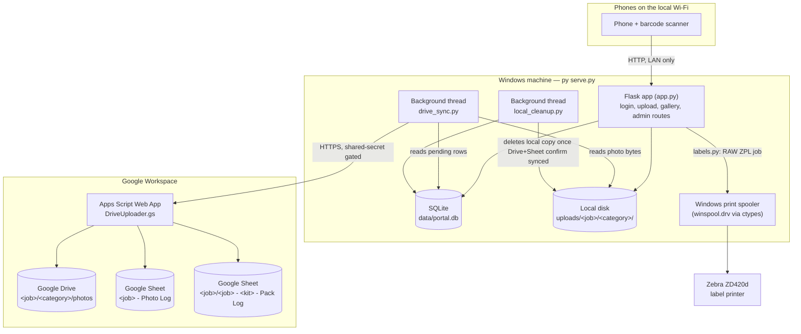
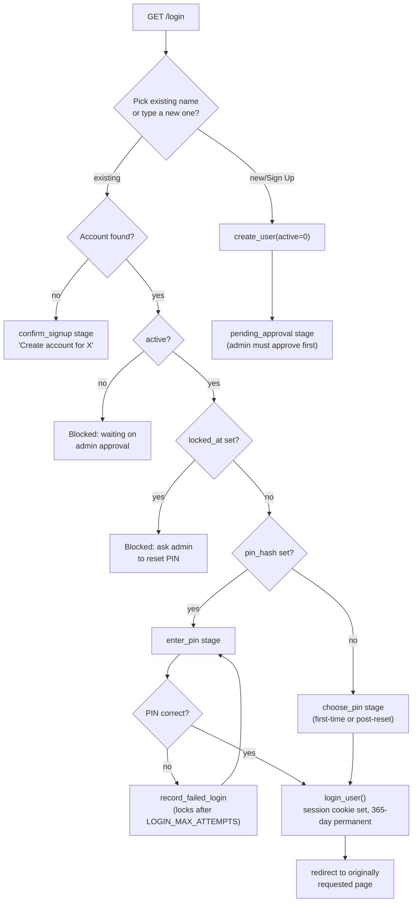
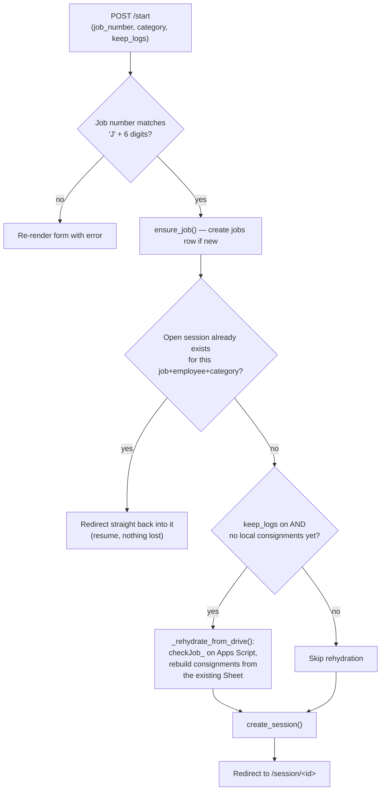
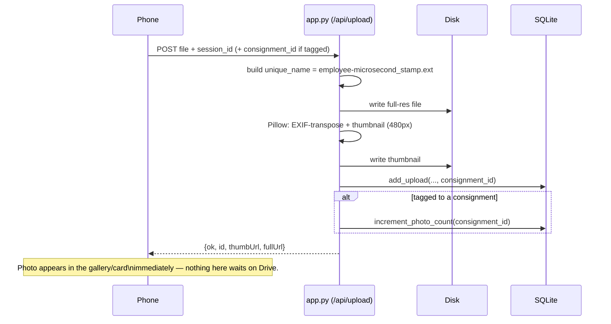
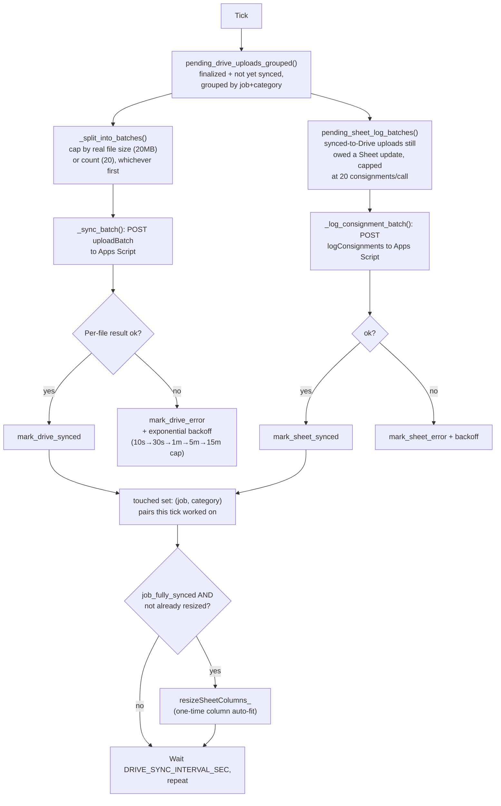
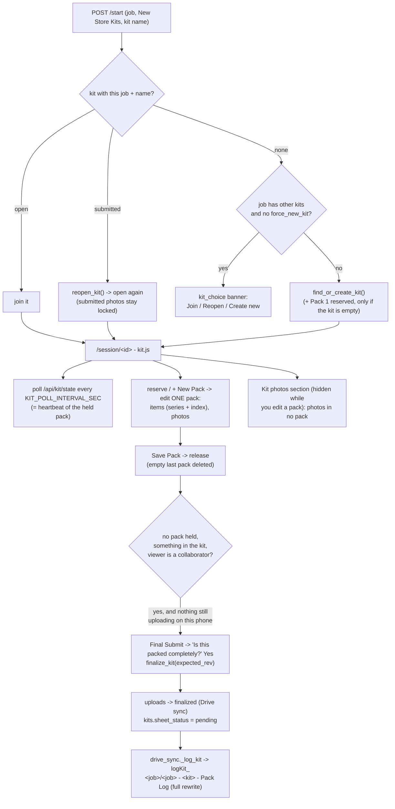
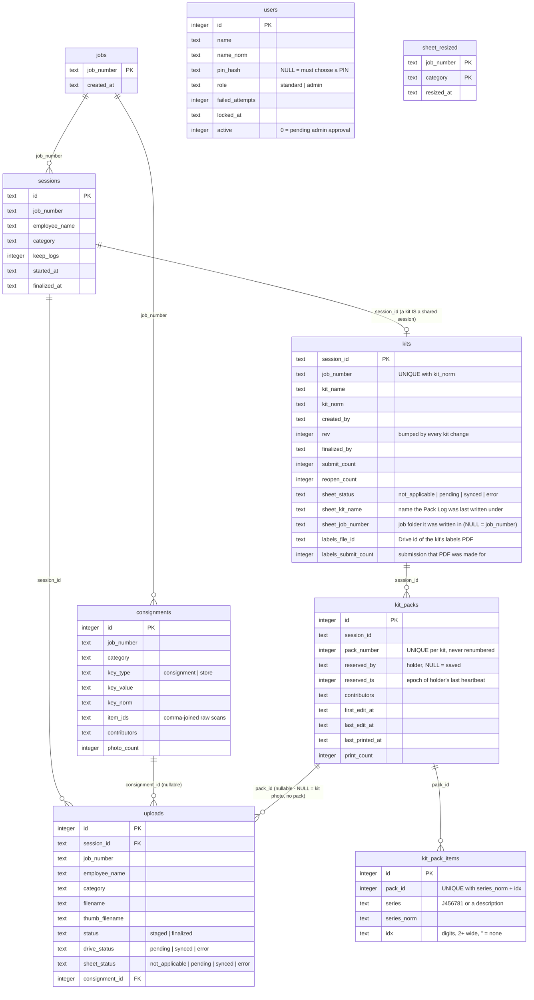

# Campaign Photo Portal — Code Guide

A phone-friendly photo capture tool for warehouse/logistics staff: workers log in with a name + 4-digit
PIN, photograph a packing/dispatch job, optionally tag photos to a Consignment #/Store name with Item
IDs, and everything is quietly synced to Google Drive (photos) and a Google Sheet (the proof log) in the
background. The local machine is the only thing that has to be reachable on the warehouse network —
Google Drive/Sheets access always goes through a single Apps Script relay, never a direct API call.

A third photo type, **New Store Kits**, is a shared, multi-person packing log: several phones work one
kit at once, each filling a numbered **pack** (item numbers typed on the phone keypad + photos), with a
live "what's missing" report, pack labels printed on the server's Zebra printer, a confirmed Final
Submit, and a per-kit Pack Log Sheet in Drive. See [§3.5](#35-new-store-kits).

## Table of contents

- [1. System architecture](#1-system-architecture)
- [2. Core concepts](#2-core-concepts)
- [3. Key flows](#3-key-flows)
- [4. File-by-file reference](#4-file-by-file-reference)
- [5. Database schema](#5-database-schema)
- [6. Configuration](#6-configuration)
- [7. Limitations & known tradeoffs](#7-limitations--known-tradeoffs)
- [8. Capacity & load-test findings](#8-capacity--load-test-findings-septoct-2026)

---

## 1. System architecture

The Python app has **zero direct Google API credentials**. Every Drive/Sheets operation is a
`requests.post()` to one Apps Script Web App endpoint, gated by a shared-secret string
(`DRIVE_SHARED_SECRET` in `.env`, matched against `SHARED_SECRET` in the script's Script Properties).

---

## 2. Core concepts

| Concept | What it is |
|---|---|
| **User** | A login account: name + 4-digit PIN, role `standard` or `admin`. Replaces the old free-text name dropdown. |
| **Job** | One packing/dispatch job, identified by job number (`J` + 6 digits). Just a `jobs` row + a folder namespace on disk/Drive. |
| **Session** | One person's open work-batch for one job+category. Holds photos until "Submit Batch" finalizes it. Auto-resumes if reopened within `SESSION_RESUME_WINDOW_HOURS`. |
| **Consignment** | (Packing only, opt-in "keep logs") One Consignment #/Store name scanned during a session — has its own Item IDs, contributor list, and photo count, mirrored to one row in that job's Google Sheet. |
| **Upload** | One photo. Always named `<employee>-<microsecond-timestamp>.<ext>` regardless of consignment tagging — the filename is never overloaded with business meaning. |
| **Finalize** | Tapping "Submit Batch" — flips a session's uploads from `staged` to `finalized`. Only finalized uploads are ever picked up for Drive sync. |
| **Drive sync** | Fully asynchronous background process. The user never waits for it — a photo is "done" the instant it lands on local disk. |
| **New Store Kit** | Photo type `new_store_kits`. ONE shared `sessions` row + one `kits` row, identified by job number + kit name (case/space-insensitive). Everyone who starts the same job + name joins the same kit; a submitted kit is **reopened** instead. Visible to every user in Active Sessions. |
| **Pack** | A numbered box inside a kit (1..N, `MAX+1`, never renumbered — boxes may already be labelled). Holds item numbers + photos. |
| **Item number** | What's typed into a pack: a **series** (`J` + 6 digits, or any free-text description) plus an optional digits-only **index** (`J456781-02`). Shown grouped per series: `J456781-02, 05, 06, 08 & 09`. |
| **Reservation** | Only the person holding a pack can change it. Sticky: released by Save Pack, opening/creating another pack, Home/Cancel, browser Back, log out, or the start page's [Release]. After `PACK_IDLE_TAKEOVER_SEC` without a heartbeat, someone else may take it over (with a confirm). Any held pack blocks Final Submit. |
| **Kit photo** | A photo in a kit that belongs to NO pack (`uploads.pack_id` NULL) — the kit page's "Kit photos" section, no reservation needed. |
| **Report** | "J456789 - Missing numbers: 02, 03, 07 & 08 until 09." (or "J456789 - Packed everything until 09.") per J-series, over SAVED packs only. |
| **Pack label** | ZPL label printed on the server's Zebra: the kit name exactly as typed / "Pack N" / the pack's item lines. |

---

## 3. Key flows

### 3.1 Login (name + PIN)

Handled entirely by **one route** (`app.py`'s `/login`) and **one template** (`login.html`) using a
`stage` string to decide which fields to show — login, self-signup, and PIN-choosing are the same
state machine at different points, not three separate pages.

### 3.2 Starting a job

### 3.3 Uploading a photo

The phone side is a queue on both kinds of page: `upload.js` (Packing/Dispatch) and `kit.js` (New Store
Kits) send two photos at a time and retry after a connection problem, so a dropped Wi-Fi connection or a
portal restart delays photos rather than losing them (see `static/upload.js` below). Once a photo is saved
here it can't be lost on the way to Drive: see §3.4 and §8.

### 3.4 Background Drive sync (one tick, every `DRIVE_SYNC_INTERVAL_SEC`)

The upload endpoint (`uploadBatch_` in Apps Script) is **idempotent by filename** — a blind retry after
an uncertain failure (e.g. a timeout where the outcome was never learned) is always safe, since an
already-created file is recognized and reused rather than duplicated (as long as the exists-check and
the create happen under `LockService`, which is what closes the one real race this system hit in
practice — see [§7](#7-limitations--known-tradeoffs)).

### 3.5 New Store Kits

- **One shared session.** A kit is a normal `sessions` row (category `new_store_kits`, `employee_name` =
  creator) plus a `kits` row. Everyone works inside that one session id; uploads and items record who
  actually did them.
- **Every change is atomic.** Each db function runs in ONE `with conn:` transaction whose conditions sit in
  the write itself: the hold check is part of the INSERT/UPDATE/DELETE, pack numbers are `MAX+1` under the
  write lock, and Final Submit is one conditional UPDATE that also checks `kits.rev` (nothing changed since
  the dialog was drawn). Python's sqlite3 opens a transaction even for a 0-row write, so every path
  commits or rolls back. The threaded tests cover double-tapped New Pack, four users reserving one pack,
  and finalize racing everything else.
- **`rev`** is bumped by every kit change (never by heartbeats). kit.js drops any state older than what it
  shows, never polls while its own change is in flight, and renders keyed and in place, so the typed item
  fields and the phone keyboard are never disturbed by a poll.
- **Reopen / resubmit.** Reopening clears `finalized_at`. Photos already submitted keep `status='finalized'`
  (locked: no delete; they're in Drive). A kit that was ever submitted can't be deleted. The next Final
  Submit bumps `submit_count`, resets the per-submission Sheet bookkeeping, and the Sheet is fully rewritten,
  and renamed if the kit was renamed (`sheet_kit_name` / `previousKitName`). Because the Apps Script finds a
  Pack Log by name, a renamed kit's OLD name stays reserved for that job (`db.kit_holding_sheet_name`) until
  its next Final Submit has renamed the Sheet; otherwise a new kit with the old name would take the Sheet over.
- **Changing a kit's job number** (the ✏️ next to the job number opens one pane for job number + kit name;
  `api_kit_rename` with `job_number` → `_kit_change_job`). An OPEN kit only. The photo files move on disk
  first, then `db.edit_kit` moves the kit, its session and every upload row in one transaction (files go back
  if it refuses: the new job already has that kit name, or another kit's Sheet still carries it). Drive follows
  on the next Final Submit: `logKit` gets `previousJobNumber` + `moveFileIds` and MOVES the Pack Log from
  `<old job>/` and the kit's photos from `<old job>/Packing Photos/` (renaming the Sheet); the labels PDF is
  replaced as usual. Moving keeps every Drive file id, so the photo links need no change.
  `kits.sheet_job_number` remembers where the Sheet still is, so the old job + name stays reserved until then.
- **Drive layout.** Kit photos go to the job's normal `<Job>/Packing Photos/` folder
  (`DRIVE_FOLDER_OVERRIDES`), each described "<Kit> · Pack N" or "<Kit> · no pack". The Pack Log sits in `<Job>/`:
  tab **Packs** (one row per pack plus a "No pack" row for kit photos) and tab **Summary** (submitter, times
  submitted, the missing-numbers report). It is written once every photo has synced; if photos are still
  missing after `KIT_SHEET_FORCE_AFTER_MIN` a partial Sheet is written and refreshed, and after
  `KIT_SHEET_GIVE_UP_HOURS` the last write stands (with a note). Folders and files sitting in Drive's trash
  are never written into (a fresh live one is made).
- **Labels PDF.** With the first Pack Log write of each submission (so only ever after Final Submit),
  `drive_sync._labels_pdf_payload` adds `labelsPdf`: `labels.kit_labels_pdf` draws every pack that has items or
  photos, one label-sized page each, the same images the printer gets. `logKit_` saves it as
  `<Job>/<Job> - <Kit> - Labels.pdf`, THEN trashes the previous one (by its recorded Drive id, so it goes even
  after a rename, plus any stray copy of the same name) and answers `labelsFileId`, which
  `db.record_kit_labels` stores with the submission number (`kits.labels_file_id` / `labels_submit_count`).
  A later write for the same submission sends no PDF; the next submission does. A PDF that can't be drawn never
  holds up the Sheet (logged as `[kit-labels]`).

### 3.6 Printing pack labels

`POST /api/kit/labels/print {pack_ids}` → `labels.label_content` (header = the kit name exactly as typed - nothing is appended, so "NSK" or any other
keyword is part of the name; subheader "Pack N",
body = `kits.pack_lines`) → `labels.layout` (ONE label per pack, laid out **landscape** — the long side
across — every line **centred**, wrapped by the text's exact measured width; the fonts shrink until
everything fits, body first, "+ N more lines" only as a last resort) → `labels.render_page` (drawn on
the server in **Arial Black** with Pillow, since the Zebra has no such font) → `labels.printer_image`
(turned 90° on stock that feeds long side first, like 100 × 150; stock that's already wider than long
prints as it feeds) → `labels.to_zpl` (one `^GFA` graphic with ZPL's `,`/`:` row
compression; no text reaches the printer, so nothing in a kit name can act as a command; no
printer-setting commands) → `labels.send_raw` (ONE RAW spooler job via ctypes on `winspool.drv`). If the
font file can't be loaded, Pillow's own font is used, and as a last resort the printer's built-in font
(portrait, `^FB`-centred text fields). With `LABEL_PRINTER_NAME` unset, the answer is
`printer_not_configured` + a link to `GET /session/<id>/labels` — the same layout rendered as HTML at the
label's real size in mm (printable from a browser), with the raw ZPL underneath.

---

## 4. File-by-file reference

### `app.py` — Flask routes

| Function | Purpose |
|---|---|
| `_load_user` / `_inject_user` | `before_request`/`context_processor` hooks — loads the logged-in user into `g.user` once per request, exposes it to every template as `current_user`. |
| `sanitize_for_filename` | Strips characters Windows folder names can't contain; also used to clean up a typed job number. |
| `job_dir` / `thumb_dir` | Resolve `uploads/<job>/<category>[/thumbs]` on disk, creating the thumbs dir as needed. |
| `_render_index` | Shared renderer for the start-job page, so every early-return doesn't repeat the same `render_template` call. |
| `index` (`GET /`) | The job-number/category start form. |
| `_render_login` | Shared renderer for `/login`'s multi-stage template — only computes `existing_names` (for the dropdown) on the `name` stage. |
| `login` (`/login`) | The whole login/signup/choose-PIN state machine — see [§3.1](#31-login-name--pin). |
| `logout` (`POST /logout`) | Clears the session. |
| `change_pin` (`/change-pin`) | Self-service PIN change for an already-logged-in user (the only way an admin can ever change their own PIN). |
| `admin_page`, `admin_create_user`, `admin_reset_pin`, `admin_approve_user`, `admin_delete_user`, `admin_toggle_role` | User-management actions, all behind `@auth.admin_required`. |
| `start` (`POST /start`) | Validates the job number, creates/resumes a session, triggers Drive rehydration if this is a "keep logs" job with no local consignments yet. |
| `_rehydrate_from_drive` | Best-effort: asks Apps Script (`checkJob`) whether this job already has a Photo Log sheet, and rebuilds local `consignments` rows from it if so — never blocks starting a session on failure. |
| `_group_photos_by_consignment` | Groups a session's photos into per-consignment sections for the upload page, most-recently-active section first. |
| `_section_json` | Serializes one section (consignment + its photos) to the JSON shape the client-side JS expects. |
| `session_page` (`GET /session/<id>`) | Renders the upload page, pre-loading grouped sections and the job's known consignment values (for autocomplete). |
| `_consignment_json` | Serializes one consignment row to the JSON shape returned by the resolve/item-ID endpoints. |
| `api_consignment_resolve` (`POST /api/consignment/resolve`) | Scans/types a Consignment #/Store name → finds or creates the row, returns its current state. |
| `api_consignment_item` / `api_consignment_item_decrement` | Add one scan of an Item ID, or remove/step down one scan — see `db.group_item_ids`. |
| `api_upload` (`POST /api/upload`) | Saves one photo to disk + thumbnail, records the DB row — see [§3.3](#33-uploading-a-photo). |
| `api_delete` (`POST /api/delete`) | Removes a not-yet-finalized photo (disk + DB), decrementing its consignment's photo count if tagged. |
| `api_finalize` (`POST /api/finalize`) | The "Submit Batch" action — flips the session and its uploads to `finalized`. |
| `gallery` (`GET /gallery/<job>`) | Read-only view of every photo ever uploaded for a job, across all sessions/employees (supervisor view). |
| `media_thumb` / `media_full` | Serves a photo/thumbnail from local disk; if it's already been cleaned up locally, redirects to its Drive view URL instead (catches werkzeug's `NotFound`, which is what `send_from_directory` actually raises). A photo with no thumbnail (Pillow couldn't read it) gets the full image instead. |
| `_start_kit` | The New Store Kits branch of `/start`: join / reopen / `kit_choice` / create, plus Pack 1 when the kit has nothing in it yet (no packs, no photos). Refuses a new kit named after another kit's not-yet-renamed Pack Log. |
| `_kit_page` / `_kit_state` | Renders the kit page; builds the per-viewer **KitState** JSON every kit API returns (packs, groups, report, working, reservations, collaborators, `canFinalize`, kit photos, `rev`). |
| `api_kit_state` | The 4 s poll + heartbeat. |
| `api_kit_pack_new` / `_reserve` / `_release` | + New Pack, open/take over a pack (`force` after the idle confirm), Save Pack / leave (also hit by `sendBeacon`). |
| `api_kit_item_add` / `_remove` | Item numbers, via `kits.parse_item` (digits-only index, combined `J456789-02`). |
| `api_kit_finalize` | Final Submit: collaborator/admin only, `confirm: "yes"`, `rev` must match. |
| `api_kit_rename` | Rename an open kit (unique per job, and not to a name another kit's Drive Sheet still carries); with a different `job_number` it moves the kit to that job (`_kit_change_job`, which uses `_move_upload_files`). |
| `api_kit_labels_print` / `labels_preview` | Print labels / the HTML preview page. |
| `_kit_upload` / `_kit_general_upload` / `_kit_delete_photo` / `_kit_delete_general_photo` | Kit photo upload/delete: pack photos need the pack held; kit photos (no pack) need only an open kit and can be removed by their uploader or an admin; submitted photos are locked. |
| `release_my_packs`, `reopen_kit_route` (`/session/<id>/reopen`), kit branch of `delete_session`, `logout` | Start-page [Release]; "Reopen to make changes"; creator/admin-only delete of a never-submitted kit; log out releases held packs. |

### `kits.py` — New Store Kit rules (pure logic, no db/Flask)

`normalize_kit_name`, `normalize_index` (digits only → `"02"`), `parse_item` (series + index, combined form,
errors worded for users), `item_label`, `join_and` (`"02, 03 & 04"`), `pack_groups` (per-series groups with
item ids — what the × buttons act on), `pack_lines` (built from `pack_groups`, so screen, Sheet and label
always agree), `series_buttons` (J-series quick-pick, first-use order), `series_report` (the "Missing numbers: … until N" /
"Packed everything until N" report; `full=False` for the per-poll page, which never materialises a huge list for a typo like 999999).

### `labels.py` — Zebra pack labels

`label_content`, `metrics_for` (Arial Black → Pillow's font → the printer's font), `layout` (landscape
design canvas, centred, measured wrapping, one label with self-shrinking fonts), `render_page` /
`printer_image` / `page_png`, `to_zpl` (`^GFA`), `decode_gf_data` (its inverse, for checking), `to_html`
(the preview = the same image), `send_raw` (ctypes winspool, RAW, aborts a half-written job),
`list_printers`, `startup_lines` (names the font and warns if `LABEL_FONT_FILE` didn't load), and a CLI:
`py labels.py --list-printers | --sample-zpl | --sample-png FILE | --test-print [--printer NAME]`.

### `auth.py` — login accounts

| Function | Purpose |
|---|---|
| `hash_pin` / `verify_pin` | Thin wrappers over Werkzeug's `generate_password_hash`/`check_password_hash`. |
| `set_pin_and_sync` | The one place a PIN actually gets set (first choice, post-reset, or self-service change) — also mirrors the value into `.env` if this is the bootstrap Admin account. |
| `ensure_bootstrap_admin` | Creates the first Admin account from `.env`'s `ADMIN_NAME`/`ADMIN_PIN` on startup, if it doesn't exist yet. Never overwrites an existing account. |
| `load_current_user` | Loads `g.user` from the session cookie's `user_id`, once per request. |
| `login_user` / `logout_user` | Sets/clears the session cookie; `login_user` marks the session `permanent` so `SESSION_LIFETIME_DAYS` actually applies. |
| `login_required` / `admin_required` | Route decorators — redirect to `/login` (or 403) if not authenticated/authorized. |

### `db.py` — SQLite storage

All access goes through one `threading.local()` connection per thread (`get_conn`), WAL mode so
concurrent phones don't block each other. Grouped by area:

- **Bootstrapping**: `init_db` (creates all tables), `_migrate`/`_add_column_if_missing` (additive
  schema changes for upgrading an existing database), `_import_legacy_employees` (one-time: imports
  the old `employees.json` name list as user accounts with no PIN set yet).
- **Jobs/sessions**: `ensure_job`, `create_session`, `get_session`, `find_open_session` (the
  resume-within-24h lookup), `finalize_session`.
- **Uploads**: `add_upload`, `get_upload`, `delete_upload`, `get_upload_by_filename`/`_by_thumb_filename`,
  `uploads_for_job` (everyone's photos), `uploads_for_session` (just this session's).
- **Drive sync bookkeeping**: `pending_drive_uploads_grouped`, `mark_drive_synced`, `mark_drive_error`,
  `uploads_ready_for_local_cleanup`, `job_fully_synced`, `is_sheet_resized`/`mark_sheet_resized`,
  `mark_local_cleaned`.
- **Consignments**: `split_list`/`_join_list` (comma-joined-string ⇄ list helpers), `has_consignments`,
  `consignment_values_for_job` (autocomplete source), `find_consignment`/`get_consignment`,
  `create_consignment`, `find_or_create_consignment` (race-safe via a UNIQUE index +
  `IntegrityError` fallback), `touch_consignment_contributor`, `_count_groups`/`group_item_ids`/
  `item_id_labels` (the scan-count feature — repeated Item IDs become `"value-N"` labels instead of
  duplicate entries), `add_consignment_item_id`/`decrement_consignment_item_id`,
  `increment_photo_count`/`decrement_photo_count`, `synced_uploads_for_consignment`,
  `rehydrate_consignment` (rebuilds a row from Drive's copy, same race-safety pattern as
  `find_or_create_consignment`), `pending_sheet_log_batches`, `mark_sheet_synced`/`mark_sheet_error`.
- **New Store Kits** (every writer is one `with conn:` transaction; `_helpers(conn, ...)` never commit):
  kits — `find_or_create_kit`, `get_kit`/`find_kit`, `list_open_kits`, `list_kits_for_job`,
  `list_kit_names`, `kit_collaborators`/`merge_collaborators`, `delete_kit` (never-submitted only),
  `finalize_kit` (one conditional UPDATE incl. `rev`), `reopen_kit`, `rename_kit`, `edit_kit` (job number + name); packs — `create_pack`,
  `reserve_pack` (idle takeover with `force`), `release_packs_held_by`, `release_all_packs_held_by`,
  `heartbeat_pack`, `held_pack`, `mark_packs_printed`; items — `add_pack_item`, `remove_pack_item`,
  `items_for_kit`; photos — `add_kit_upload` / `delete_kit_upload` (hold-checked in the statement),
  `add_kit_general_upload` / `delete_kit_general_upload` / `general_photo_uploaders` (no-pack kit photos);
  Sheet bookkeeping — `pending_kit_sheets`, `kit_upload_sync_counts`, `synced_kit_uploads`,
  `mark_kit_sheet_written`, `record_kit_sheet_name`, `mark_kit_sheet_error`.
- **Users**: `create_user`, `delete_user` (hard delete — `employee_name` elsewhere is a denormalized
  string, never a foreign key, so this can't orphan history), `find_user_by_name`, `get_user`,
  `list_users`, `list_active_user_names`, `set_pin`, `record_failed_login` (locks the account at
  `LOGIN_MAX_ATTEMPTS`), `clear_failed_attempts`, `reset_pin` (admin action), `set_user_active`,
  `set_user_role`.

### `config.py` — central settings

Not functions so much as **named constants** everything else imports rather than hardcoding: batch
size/count caps, timeouts, backoff steps (documented in `drive_sync.py`), category labels,
`SESSION_LIFETIME_DAYS`, `LOGIN_MAX_ATTEMPTS`, cleanup timing, server bind address/port/thread count.
Two functions: `update_admin_pin_in_env` (keeps `.env`'s `ADMIN_PIN` mirroring reality) and
`load_drive_config` (reads `DRIVE_WEBAPP_URL`/`DRIVE_SHARED_SECRET`, or `None` if not configured yet).

### `drive_sync.py` — background Drive/Sheets relay

See [§3.4](#34-background-drive-sync-one-tick-every-drive_sync_interval_sec) for the flow. Function
purposes:

| Function | Purpose |
|---|---|
| `_backoff_seconds` | Exponential backoff ladder for retrying a failed row: 10s → 30s → 1m → 5m → 15m (capped). |
| `check_job_in_drive` | Synchronous (not part of the loop) — asks Apps Script if a job's Sheet already exists, for `app.py`'s rehydration path. |
| `_split_into_batches` | Slices one job+category's pending rows into upload batches capped by real on-disk file size (primarily) or count (fallback). |
| `_sync_batch` | One Apps Script `uploadBatch` call for a batch of photos; marks each row synced/errored independently based on its own per-file result. |
| `_log_consignment_batch` | One Apps Script `logConsignments` call for a batch of consignments; sends each one's *full current snapshot* (not a delta), so a retry can never double-append anything. |
| `_resize_sheet_columns` / `_maybe_resize_sheet` | Fires the one-time column auto-fit once a job+category has nothing left pending, guarded so it never fires twice for the same job. |
| `_run_loop` | The daemon thread's main loop — ties the above together every `DRIVE_SYNC_INTERVAL_SEC`, catching exceptions at every level so one bad batch/job never kills the thread. |
| `start_background_sync` / `stop_background_sync` | Thread lifecycle. |
| `_kit_note` | "<Kit> · Pack N" / "<Kit> · no pack" — appended to a kit photo's Drive description (kit photos share `<Job>/Packing Photos`, category name overridden by `DRIVE_FOLDER_OVERRIDES`). |
| `_kit_payload` / `_log_kit` / `_mark_kit_sheet_error` | Builds and sends a submitted kit's full Pack Log snapshot (`logKit`); waits for photos, writes partial Sheets after `KIT_SHEET_FORCE_AFTER_MIN`, gives up after `KIT_SHEET_GIVE_UP_HOURS`; re-reads the kit around the call so a reopen mid-write is never overwritten; sends `previousKitName` after a rename and `previousJobNumber` + `moveFileIds` after a job change. Prints a redeploy hint on `unknown or missing action`. |
| `_labels_pdf_payload` / `_record_labels_result` | The kit's labels PDF, once per submission, with the previous PDF's id for `logKit_` to trash; records the new id (or says the Apps Script needs redeploying). |
| `_run_loop` / `_fail_batch` / `SOLO_AFTER_FAILURES` | The sync thread: one pass every `DRIVE_SYNC_INTERVAL_SEC`. Starts each pass with `db.rollback_if_open()`; marks a failed batch's photos (not the ones already synced) for retry; sends the photos of a batch that keeps failing while Drive works one at a time, so one bad photo can't hold up the rest (§8.2). |
| `_call_web_app` | Every Web App call goes through it: says which of script.google.com / the googleusercontent.com result page answered, how long it took and what an error page said (not just "404" / "Expecting value"), and retries once after `QUICK_RETRY_DELAY_SEC` for the repeat-safe `uploadBatch` / `logKit`. |

### `local_cleanup.py` — disk space reclamation

| Function | Purpose |
|---|---|
| `_cleanup_one` | Deletes one upload's full-res file + thumbnail, marks it cleaned in the DB. |
| `_rmdir_if_empty` | Removes a directory only if `rmdir()` succeeds naturally (i.e. it's genuinely empty) — can never force-delete a file, so a concurrent session's still-in-progress files simply block pruning until they're done. |
| `_prune_empty_dirs` | Walks `uploads/<job>/<category>/thumbs` bottom-up, removing anything now empty. |
| `_run_loop` | Every `LOCAL_CLEANUP_INTERVAL_SEC`, cleans everything `db.uploads_ready_for_local_cleanup` returns (synced to Drive **and** Sheet, and old enough), then prunes empty directories. |
| `start_background_cleanup` / `stop_background_cleanup` | Thread lifecycle. |

### `serve.py` — production entry point

| Function | Purpose |
|---|---|
| `_detect_phone_address` | Best-effort LAN IP to print at startup — prefers Windows Mobile Hotspot's fixed `192.168.137.x`, else asks the OS which address it'd use to reach the internet. |
| `_find_python_pids_on_port` | Finds any `python.exe`/`py.exe`/`pythonw.exe` process actually LISTENING on the target port, via `netstat` + `tasklist` — never touches an unrelated process on a different port. |
| `_kill_stale_port_holders` | Clears a leftover process from an earlier run before binding — see [§7](#7-limitations--known-tradeoffs) for why this is needed at all. |
| `__main__` block | Runs the stale-port cleanup, DB init, admin bootstrap, starts both background threads, then `waitress.serve(...)`. |

### `apps-script/DriveUploader.gs` — the only Drive/Sheets access point

A headless (no UI) Apps Script Web App. One shared secret gates every call; `doPost` dispatches on
`action`.

| Function | Purpose |
|---|---|
| `doPost` | Entry point — checks the secret, routes to one of the four actions below. |
| `uploadBatch_` | Creates/reuses each file in a batch. The exists-check + create is wrapped in `LockService` — the one place in this file where a real concurrency bug was found and fixed (see [§7](#7-limitations--known-tradeoffs)). |
| `getOrCreateJobFolder_` / `getOrCreateChild_` | Finds or creates `<job>/<category>` under the target parent folder; locked so two near-simultaneous first-uploads for a new job can't create duplicate folders. |
| `logConsignments_` | Writes/updates one Sheet row per consignment in the batch — merges Item IDs/contributors/photo links into what's already there rather than overwriting, using the portal's own recorded scan timestamps rather than this execution's clock. |
| `mergeLists_` / `splitTrimmed_` | Case-insensitive union of a delimited cell value with an incoming list, and the reverse (cell → trimmed list). |
| `checkJob_` | Read-only — tells the portal whether a job already has a Photo Log sheet, and hands back every row (for local rehydration). |
| `findLogSheet_` | Read-only lookup of an existing Photo Log sheet — never creates one (unlike `getOrCreateLogSheet_`). |
| `resizeSheetColumns_` | One-off formatting pass: auto-fits the plain-text columns, pins Photo Links to a fixed width (auto-fit fights its line-wrapped long URLs otherwise). |
| `getOrCreateLogSheet_` | Finds or creates `<job> - Photo Log`, with header row, frozen header, column widths, and wrap formatting. |
| `guessMime_` / `jsonOut` | Small helpers — extension → MIME type, and JSON response formatting. |
| `logKit_` | One New Store Kit's `<Job> - <Kit> - Pack Log` in the `<Job>` folder: tabs Packs (+ a "No pack" row) and Summary, FULLY rewritten each call (idempotent); text cells formatted `@` before writing so "09", "1/2" or "=x" stay literal; renames the old-name file after a kit rename, and after a job change moves it (and, via `moveKitPhotos_`, the kit's photos) from the old job's folders. With `labelsPdf`, `replaceKitLabelsPdf_` saves `<Job> - <Kit> - Labels.pdf` and then trashes the previous one. |
| `getOrCreateJobRootFolder_` / `getOrCreateKitSpreadsheet_` / `findLiveFileByName_` / `findLiveFolderByName_` / `writeKitPacksTab_` / `writeKitSummaryTab_` | Its helpers (locks never nested; trashed files AND folders ignored everywhere, photos included; 0-row ranges never touched). |
| `testGetOrCreate`, `authTestDeleteMe`, `checkDuplicateFilenames` | Manual, editor-run-only diagnostics — never reachable via `doPost`. |

### `static/upload.js` — the upload page's client-side logic

Two mutually exclusive modes share one submit-button handler at the bottom:

- **Grouped mode** (consignment logging on): builds tappable per-consignment cards
  (`buildCard`/`renderSections`), each opening a native `<dialog>` popup (`openDialog`,
  `renderDialogChips`/`renderDialogGallery`) with delete controls for photos and Item IDs. Handles
  scanning/typing a Consignment #/Store name (`resolveConsignment`, with live autocomplete via
  `updateSuggestions`/`hideSuggestions`) and Item IDs (`addItemId`, `stepItemId` for the +/- scan-count
  chips built by `buildChip`).
- **Flat mode** (no logging): one plain photo grid (inline delete handling).

Each mode only supplies `uploadHooks` (`placeTile`, `onSaved`, `addFields`, `countSaved`). The **upload
queue** is shared, and it exists because the load tests showed the old way (every picked photo fired at
once, no timeout, no retry) lost photos whenever a phone's connection dropped mid-batch. A 100-photo pick
takes ~18 min over a busy hotspot; a 10 s portal restart failed 221 queued photos within 0.8 s, and every
dropped connection lost its photo (32 of 32). Now:

- `handleFiles` → `addToQueue` → `pump` → `sendJob` (XMLHttpRequest, for upload progress):
  at most `MAX_PARALLEL_UPLOADS` (2) at once, the rest wait in order. The consignment a photo belongs to
  is fixed when it's PICKED (`addFields`), so scanning the next consignment mid-batch can't move it.
- A **connection problem** (network error, a dropped connection, a 5xx or a non-JSON answer, or a stall:
  no upload progress for `STALL_MS` 60 s, or no answer `ANSWER_WAIT_MS` 90 s after the photo was fully
  sent) never fails a photo: it goes back to the front of the queue and the whole queue pauses for
  `RETRY_DELAYS_S` (2, 5, 10, 20, 30, then 60 s, for as long as the page is open), or resumes at once on
  the browser's `online` event or when the page becomes visible again. There's no fixed time limit, so a
  big photo on a slow link is never cut off while it's still moving.
- Only a clear **refusal** (JSON `ok:false`, e.g. "This batch was already submitted") fails a photo:
  its tile shows the photo itself (an object URL) with **Retry** and **×**.
- A redirect to `/login` (logged out elsewhere) pauses the queue with "Log in (new tab) → Try again".
- `#uploadStatus` says how far the pick has got, or that photos are waiting ("nothing is lost");
  `beforeunload` asks before leaving while anything is waiting or failed; **Submit** waits for both.
- A photo that dies with the page (tab closed, browser killed) is still gone: a library pick can be picked
  again, but a **Take Photo** shot may exist only in that page. That's why the page says to keep it open.
- A retry after a connection that dropped *just after* the portal saved the photo can store it twice
  (the portal has no upload id to recognise a repeat). Rare, visible and removable; accepted by the
  owner rather than risking a lost photo.
- Tested in `scratchpad/e2e/upload_queue_e2e.mjs`: Wi-Fi off for 8 s and a portal kill + restart in one
  30-photo batch (30/30 saved, 0 duplicates, ≤ 2 in flight), a consignment switch mid-batch, a refusal +
  Retry, a logout mid-batch, and the leave-page prompt.

Also shared: `setCaptureEnabled` (camera/library greyed out until a consignment is resolved) and the
Submit handler (`/api/finalize`).

### `static/kit.js` — the New Store Kit page (loaded INSTEAD of upload.js in kit mode)

- **State**: `apply()` accepts only states with `rev >=` the last one shown; `render()` is keyed and in
  place (`syncKeyed`) and never touches the item inputs, so a poll can't drop the phone keyboard.
- **Polling / heartbeat** every `kit_poll_ms` while visible, never overlapping a change of its own; every
  request has a timeout; branching is on the JSON `code`, never the HTTP status.
- **Item entry** tuned for the phone keypad: auto-advance from series to index at `J` + 6 digits, digits-only
  index (`inputmode=numeric`, no `maxlength`: a paste is handled whole), focus kept synchronously in the tap so the
  number pad stays up, a pasted `J456789-02` split into both fields (in either field), a paste that isn't
  one number refused with a hint, a typed-but-not-added index added automatically before leaving a pack.
  The auto-advance fires once per series, so someone who comes back can type "J456789 window kit". Index
  adds that fail together are all kept (`failedAdds`): named in the error, re-sent by Add with an empty
  field or before leaving the pack.
- **Layout** (top to bottom): nav bar, "Working now" + the "Packed so far" report, the pack editor OR
  "+ New Pack" (next number in the small line under it) with the print controls, Kit photos, the pack cards.
- **Packs**: grouped item lines with a × per index, lock/idle badges, takeover confirm, the pack dialog,
  the Save Pack row with the bulk print controls, per-pack print + checkbox, Final Submit dialog.
- **Photos**: a two-at-a-time upload queue with Retry tiles; pack photos need the pack held, kit photos
  ("Kit photos (not in a pack)", hidden while this person has a pack open) don't; locked (already submitted) photos show ☁️ and no ×; cleaned-up
  local copies show an "In Drive" tile. Final Submit is held back (with "Wait for N photo(s)…") while any
  photo on this phone is still uploading or failed, so a kit photo can't be left out of the submission.
- **Leaving**: 🏠/Cancel release with a keepalive fetch, Back/bfcache with `sendBeacon`.
- **Edit pane** (✏️ next to the job number): job number + kit name in one form; a job change asks to confirm
  first; every phone's topbar and tab title follow the state.

### `static/topbar.js`

One small behavior, shared across every page via the `_user_menu.html` partial: tap the name/icon to
reveal the Change PIN/Admin/Log out dropdown, tap anywhere else to close it.

### Templates

| Template | Renders |
|---|---|
| `index.html` | Job-number + category start form; also owns the job-number live-validation JS (shake + custom bubble, no native browser tooltip — see the field's own inline comments for exactly which mobile-browser quirks that works around). |
| `upload.html` | The camera/gallery page — hydrates `window.SESSION_ID`/`INITIAL_SECTIONS`/etc. from a `<script id="pageData">` tag's `data-*` attributes (not inline `{{ }}` in a `<script>` body — keeps editor syntax highlighting intact and avoids the `"` vs `'` attribute-quoting trap `tojson` output can hit). |
| `login.html` | The name+PIN state machine's one template, branching on `stage`. |
| `admin.html` | User list + add-user form, approve/reset-PIN/toggle-role/delete actions. |
| `change_pin.html` | Self-service PIN change. |
| `gallery.html` | Read-only supervisor view (kit photos tagged "<Kit> · Pack N" / "no pack"). |
| `labels_preview.html` | Pack labels as a printable page at the real label size, plus the raw ZPL. |

`index.html` also carries the non-aggressive job-number autocomplete (≥3 typed characters that are still a
valid `J`+digits prefix, prefix match, max 5, most recently used first, tap to fill — never auto-fills),
the New Store Kit name field with open/submitted kit suggestions, the `kit_choice` banner, and the
everyone-visible kit cards in Active Sessions (collaborators, who's working, "You still have Pack N open").
`upload.html` has a `kit_mode` branch that is only the skeleton kit.js renders into.
| `_user_menu.html` | Shared dropdown partial, ``d into every authenticated page's topbar. |

---

## 5. Database schema

---

## 6. Configuration

Everything tunable lives in `config.py`, with real values supplied via `.env` (never committed —
see `.env.example`):

| Variable | Purpose |
|---|---|
| `DRIVE_WEBAPP_URL` / `DRIVE_SHARED_SECRET` | Apps Script endpoint + its shared-secret gate. |
| `SECRET_KEY` | Flask session cookie signing key — changing it logs everyone out. |
| `ADMIN_NAME` / `ADMIN_PIN` | Bootstrap Admin account; `ADMIN_PIN` is kept live-mirrored to that account's actual current PIN as a "break glass" recovery path. |
| `LABEL_PRINTER_NAME` | The Zebra's exact Windows printer name (`py labels.py --list-printers`). Empty = Print opens a preview instead. |
| `LABEL_WIDTH_MM` / `LABEL_HEIGHT_MM` / `LABEL_DPI` / `LABEL_MARGIN_MM` | Label stock as it feeds (width = across the print head, at most 104 mm on the ZD420d; a wider value is swapped with the height, with a warning, or refused); defaults 100 × 150 mm (4×6" courier label), 203 dpi, 4 mm. Read when printing, so a server restart after editing is all it takes. |
| `LABEL_ORIENTATION` | `landscape` (default, long side across as it's read: turned 90° on 100 × 150 stock, as it feeds on already-wide stock), `landscape-flipped` (the other way up), or `portrait`. |
| `LABEL_FONT_FILE` | The .ttf labels are drawn with; default Arial Black `C:\Windows\Fonts\ariblk.ttf`. |

New Store Kit knobs in `config.py`: `PACK_IDLE_TAKEOVER_SEC` (600), `KIT_POLL_INTERVAL_SEC` (4),
`KIT_SHEET_FORCE_AFTER_MIN` (30), `KIT_SHEET_PARTIAL_RETRY_MIN` (10), `KIT_SHEET_GIVE_UP_HOURS` (24),
`KIT_NAME_MAX_LEN` (60), `DRIVE_FOLDER_OVERRIDES` (kit photos → "Packing Photos"). Label font sizes
(`HEADER_SIZE` / `SUBHEADER_SIZE` / `BODY_SIZE`, as share of label height with mm limits) are at the top
of `labels.py`.

---

## 7. Limitations & known tradeoffs

Being direct about what this system does **not** solve, rather than only what it does:

- **Single point of failure.** Everything — the web server, the SQLite database, the only copy of a
  photo before it syncs — lives on one Windows machine. If it's off, nothing works, for anyone. There
  is no failover.
- **No true "runs before login, no admin needed."** A real Windows Service (the standard way to run
  something before any user session starts) requires administrator rights to install, full stop —
  there's no clever non-admin substitute. Without admin, the best available option is "launches the
  moment this Windows account logs in" (Task Scheduler's "At log on" trigger), which still depends on
  either a human logging in or the machine already being configured for auto-logon (itself an
  admin-only setting).
- **Apps Script, not the Drive/Sheets API directly.** Every Drive/Sheets operation is proxied through
  one Apps Script Web App. That means: a 6-minute hard execution cap per call (the reason uploads are
  batched by size rather than sent one-by-one or all-at-once), no real HTTP status codes (just an
  `{ok, error}` JSON convention), and a "did my last edit actually redeploy" foot-gun — Apps Script
  requires a manual `Deploy > Manage deployments > New version` after every code change; editing the
  script alone does not update the live Web App URL.
- **The one confirmed concurrency bug, and its fix's own limit.** `uploadBatch_`'s per-file
  exists-check-then-create was unlocked long enough to produce real duplicate files in Drive under
  overlapping calls (traced to either two accidental server processes, or a client-side retry racing
  an earlier attempt that timed out locally but kept running server-side). `LockService` around that
  one critical section closes it — but Apps Script's `LockService` is a single **project-wide** lock,
  not a per-file one, so heavy concurrent traffic across unrelated jobs now briefly serializes against
  each other too. At this app's real scale (10-15 users) that's a non-issue; it wouldn't necessarily
  stay that way at much higher concurrency.
- **PIN security model.** A 4-digit PIN is not, by itself, strong authentication — it's protected by
  the login being pinned to a name (not a public username) and a lockout after `LOGIN_MAX_ATTEMPTS`
  failed tries, not by PIN entropy. This is a deliberate tradeoff for phones shared across a shift, not
  a personal-device login — sessions are also set to last a full year rather than expiring quickly, on
  the same reasoning ("stay logged in until someone taps Log out").
- **No enforced network-level access control.** The app trusts whoever can reach it on the local
  network. Today that's naturally narrow (a private Wi-Fi hotspot/router), but nothing in the
  application itself would stop a request from anywhere that could reach the machine's address —
  keeping it off the open internet is a network-topology decision, not something the code enforces.
- **Local file cleanup depends on both Drive *and* Sheet sync finishing.** A photo tagged to a
  consignment won't have its local copy deleted until its Sheet row is confirmed updated too, not just
  the Drive file — correct for not losing the paper trail, but means a stuck Sheet sync (e.g. a
  persistently failing consignment) also stalls disk cleanup for every photo under it, indefinitely,
  until that error clears.
- **Employee names/self-signup are still self-reported at the point of account creation.** Anyone who
  can reach `/login` can type any first name and request an account (subject to admin approval) —
  there's no identity verification beyond an admin recognizing the name before approving it.
- **Windows-specific throughout.** The Mobile Hotspot address detection, the launcher-chain/stale-port
  workaround, and the NSSM/Task Scheduler guidance are all Windows-only; none of this has been
  written with cross-platform hosting in mind.
- **New Store Kits need the Apps Script redeployed.** `logKit` (and later the "No pack" row, "Times
  submitted", Sheet rename and the labels PDF) exist only in the updated `DriveUploader.gs`. Until it's redeployed as a New
  version, kit photos still sync (they use the existing upload action), but kit Sheets just retry with a
  "[kit-sheet] Apps Script is out of date" hint in the console.
- **Reservations rely on the phone's heartbeat.** A pocketed or locked phone stops polling. Its pack stays
  reserved (it still blocks Final Submit), and after `PACK_IDLE_TAKEOVER_SEC` someone else may take it over,
  deliberately, after a confirm. Closing a tab outright (no Back, no 🏠) can leave a pack held until then, or
  until its holder logs out or taps [Release] on the start page.
- **Labels are images.** Each label is drawn in Arial Black on the server and sent as one `^GFA` graphic
  (~30-100 KB per label, fine over USB). Text is measured exactly and the preview is the very image
  printed, but the first real label should still be checked for darkness/position on the actual stock;
  font shares and limits are constants at the top of `labels.py`. Printing needs the Windows spooler (`winspool.drv`); if the portal runs as a
  service under another account, the printer must be installed for that account (or for all users).
- **Thumbnails of images Pillow can't read** (e.g. HEIC without a plugin) fall back to the full image, which
  is slower on a phone. Browsers usually hand over JPEGs anyway.

## 8. Capacity & load-test findings (Sept–Oct 2026)

**The load tested:** 10–13 people at once, each on a phone, all on one Windows PC running `serve.py`. One person
may pick 50–100 photos in one go. A busy day is 6–7 campaigns of that size: ~700 photos and ~3–3.5 GB. Drive
uploads may be delayed; what must never happen is a lost photo.

**How it was tested:** 5 code audits plus 6 worst-case scenarios (S1–S6), each run alone, on a 12-core dev laptop
(i7-1250U, 16 GB RAM, SSD; Python 3.14, waitress 3.0.2, Flask 3.1, Pillow 12.3). The server PC may be slower, so
treat timings as best-case. Everything ran through the real code, served by waitress exactly as `serve.py` does,
against an isolated copy (temp DB and uploads). Phones were simulated (realistic photos, browser-like
concurrency, bandwidth limits), plus real Chrome for the upload queue. Drive was a fake Apps Script that behaves
like Google's (302 → echo page, same-name reuse, injected 404s, error pages, hangs and outages). Real Drive and
the printer were never touched.

### 8.1 Results at a glance

| Scenario | What was thrown at it | Result |
|---|---|---|
| S1 Peak mixed day | 13 phones at once: Packing + consignments, Dispatch, 2 kits; 1,210 × 12 MP (5 GB) | 0 lost / duplicated / errors. LAN: all on the PC in **114 s**. Hotspot 40 Mbit/s shared: **18.9 min**, i.e. **~18 min for one person's 100 photos**. Server mostly idle: 0.27 CPU-s per photo, 275–457 MB RAM. |
| S2 Big & odd images | 13 × 100 × 48 MP (16 GB) at once; 0-byte, HEIC, truncated, 108/200 MP, 60 MB, rotated | 0 lost. Peak RAM **1.6 GB**; stayed responsive (kit poll p50 27 ms). A burst of 108 MP photos can need ~0.9 GB *each* (full-size decode for the thumbnail). Odd files never crashed it; 0-byte / HEIC / truncated / 200 MP are saved without a thumbnail. Rotated photos come out upright. |
| S3 One kit, 13 people | 1 kit grown to 100 packs, ~1,000 items, 700 photos; 4 editing, 9 polling | Reservations never clashed; report always right; Final Submit 0.02–0.08 s with 12 phones polling. Kit refresh is **~245 KB per poll** at 700 photos. |
| S4 Network faults & crashes | dropped uploads, very slow phones, >100 connections, hard kills mid-batch | Database intact after every kill; no partial files. **Before the fix, Packing/Dispatch lost photos** (258 of 520 in a 10 s restart; 32 of 32 dropped uploads) — fixed, see 8.2. A retry after a lost reply can store a photo twice. |
| S5 A day's Drive backlog | 7 campaigns + 13 phones working; Apps Script with 5 % 404s, 3 % error pages, a 5.5-min hang, a 10-min outage, a portal kill mid-batch | **1,120 of 1,120 photos in Drive exactly once.** 45 retries reused the copy already in Drive. Local cleanup deleted only Drive-confirmed photos. A day's backlog takes **~2.5 h** to reach Drive at a realistic Apps Script speed. |
| S6 Weeks of use | 4 weeks of history (19,188 uploads, 155 jobs, 40 kits) + 13 phones for 5 min | No slowdown: DB 7.8 MB (~100 MB/year), WAL ≤ 4 MB, every hot path < 16 ms. **Local cleanup removes at most 50 photos/hour** (see 8.3). |

### 8.2 Can a photo be lost? (the owner's question)

- **Phone → portal PC.** This was the real gap. The Packing/Dispatch page fired every picked photo at once
  with no retry, so a Wi-Fi drop or a portal restart lost the rest of the pick, silently. **Fixed 2026-09-30
  (commit 345fc30):** `upload.js` now queues photos (2 at a time) and retries forever after any connection
  problem (§4, `static/upload.js`). The kit page already queued. Re-tested in real Chrome: an 8 s Wi-Fi drop
  plus a portal kill + restart in one 30-photo batch saved 30/30. The skeptic reviewers confirmed the old
  failure modes no longer apply to the committed code. **What's left:** a photo still on the phone when the
  page is closed (a library pick can be picked again; a *Take Photo* shot is gone), and a rare duplicate when
  the connection drops just after the PC saved a photo.
- **Portal PC → Google Drive.** **No photo was lost in any run** (S1 1,210; S2 1,300; S3 700; S4 535 after
  crashes; S5 1,120 with every fault above). Drive sync retries until Drive confirms each photo, reuses a
  same-named file instead of storing it twice, and the local copy is never deleted before that.
  Code review found ways a photo could get **stuck** — never lost, since the local copy stays. The first three
  are **fixed (2026-10-05)**, each with a test that drives the real sync loop against a fake Apps Script
  (`scratchpad/tests/test_drive_stuck.py`, `test_request_lock.py`):
  1. *Sync stuck after a long database lock* — reproduced: after one "database is locked" (a lock held
     > 30 s, e.g. `portal.db` open in DB Browser) Python's sqlite3 left the transaction open, the next read froze
     the connection's view, and every later write failed for good, so the sync thread re-sent the same photos
     every tick and marked none synced. **Fix:** `db.rollback_if_open()` — called at the start of every Drive-sync
     and local-cleanup pass and after any error in them, and at the end of every web request
     (`app.py` `teardown_request`, which also stops a web-server thread being left broken the same way).
     A batch that fails half-way no longer flips its already-synced photos back to "error" (`_fail_batch`).
  2. *Missing local files blocked the queue* — a photo whose file was deleted by hand was retried with no delay,
     so 200 of them filled the sync's whole window. **Fix:** it now backs off like any failure (10 s … 15 min)
     and the console names it once.
  3. *One bad photo blocked its batch* — a photo that makes the whole Apps Script call fail (e.g. one that's too
     big) kept its 2–4 batch-mates from syncing. **Fix:** a batch that fails while Drive is demonstrably working
     (another batch got through in the same pass, or since it last failed) is re-sent one photo at a time, so only
     the bad one keeps failing; after `SOLO_AFTER_FAILURES` (8) failures in a row it goes one at a time anyway.
     During a real outage nothing gets through, so batches stay whole and the backlog drains at full speed after.

  Not changed:
  4. *A photo that lands while its batch is being Submitted* is saved but never sent. The upload queue now makes
     Submit wait for every photo, so this needs a second phone on the same batch.
  5. *Very slow office uplink*: each ~20 MB batch must finish sending within 240 s, so below ~1 Mbit/s nothing
     reaches Drive.
  6. *Drive storage full*: at ~3.5 GB/day (~100 GB/month), a small Google storage plan fills within days to
     weeks; then every photo just keeps retrying.

### 8.3 Sizing and running it

- **Wi-Fi: Windows Mobile Hotspot allows only 8 devices.** For 10–13 phones use a Wi-Fi router or access point.
  Time per photo ≈ photo size × phones uploading ÷ total Wi-Fi speed: 100 × 4 MB photos with 13 phones sharing
  40 Mbit/s takes ~18 min per person; at 10 Mbit/s over an hour. Tell staff to keep the page open.
- **Server PC.** CPU is not the limit (0.27 CPU-seconds per 12 MP photo). RAM: 8 GB+; a burst of 48 MP photos
  peaked at 1.6 GB, and 108 MP photos can need ~0.9 GB each while their thumbnail is made.
- **Keep the PC on 24/7.** Local cleanup deletes at most 50 photos/hour (2 days after they reach Drive). Always on:
  local copies peak ~7 GB. On ~11 h/day: cleanup never catches up and the disk grows ~0.6 GB/day indefinitely.
- **Free disk.** Keep ≥ 50 GB free for `uploads/`. If Drive is down for a week, local copies reach ~25 GB and take
  ~2 weeks to clear afterwards. There is no low-disk warning; a full disk makes uploads fail (the page retries).
- **Google Drive storage.** ~3.5 GB/day, ~100 GB/month. Check the plan of the account that owns the Apps Script.
- **Office internet.** Drive sync uses the uplink for 1–3 h on a busy day.
- **The database.** Don't open `data/portal.db` in DB Browser or similar while the portal runs (a held lock can stall
  it — item 1 above). Back up with the portal stopped. Keep `data/` off OneDrive/Dropbox/network drives.
- **The console window.** Clicking or selecting text in it (QuickEdit) pauses printing, which can freeze the threads
  that print until Esc is pressed. Don't click in it, or turn QuickEdit off.
- **History.** No slowdown after weeks (S6); about 100 MB of database a year.

### 8.4 Found but deliberately not changed (owner, 2026-09-30: "only photo loss matters")

| Issue | Effect | Severity |
|---|---|---|
| Kit page aborts each upload at a fixed 120 s, including send time | On a very slow shared hotspot (< ~8 Mbit/s for 13 phones) kit photos time out and need Retry | Medium |
| No upload id, so a retry after a lost reply stores the photo again | Occasional duplicate, visible and removable | Medium |
| Thumbnail decodes the full-size photo | ~100 MB RAM per 12 MP, ~400 MB per 48 MP, ~0.9 GB per 108 MP while it's processed | Medium |
| waitress defaults (`connection_limit` 100, `channel_timeout` 120 s) | ~20 spare connections at 13 phones; stuck connections can block new ones for ~2 min | Medium |
| Kit refresh sends the whole kit every 4 s, uncompressed | ~245 KB per poll at 700 photos; a noticeable share of hotspot airtime | Medium |
| Kit page: a dropout fails the queued photos, each needing a Retry tap; a pack can't be saved while its photos upload | Extra taps on a flaky link | Medium |
| No size cap or content check on uploads | Empty / junk / huge files accepted as photos; 0-byte and > ~50 MB ones never reach Drive | Low |
| A crash mid-save leaves orphan files nobody deletes | Wasted disk only | Low |
| Changing the job number while a pick is uploading | Photos split across the old and new job | Low |
| Label preview embeds the raw ZPL | 11.9 MB page for a 100-pack kit | Low |
| `/media` URLs need no login and create empty folders for unknown jobs | Clutter (cleanup prunes hourly) | Low |
| Filenames are timestamps to the microsecond | Owner decided not to pursue | — |

### 8.5 The load-test tools

The harness (simulated phones, fake Apps Script, resource sampler, integrity report, scenario files) and the
full per-scenario reports were built in the Claude Code session's temporary scratchpad, **not in this repo**
(`.../scratchpad/load/`: `HARNESS.md`, `run_scenario.py`, `results/S1…S6*.md`; the Chrome upload-queue test is
`.../scratchpad/e2e/upload_queue_e2e.mjs`). Copy them into the repo (e.g. `tools/loadtest/`) if they should be
re-run on the server PC.

### 8.6 Quick answers

- *Can 13 people upload 100 photos each at the same time?* Yes. Nothing was lost or broken; the Wi-Fi is the
  limit (~18 min per person at 40 Mbit/s shared), not the PC. You need a router/access point for more than 8 phones.
- *What if the Wi-Fi drops or the PC restarts mid-upload?* The page says "Connection problem - N photo(s) waiting,
  nothing is lost" and carries on by itself. Keep the page open.
- *What if Google Drive or the internet is down for a day?* Photos wait on the PC and go up afterwards, each
  exactly once. Local disk grows ~3.5 GB/day meanwhile.
- *How long until photos are in Drive?* After Submit: minutes for one campaign, ~2–3 h for a heavy day's backlog.
- *How much disk does the PC need?* ~7–10 GB in normal use with the PC always on; keep 50 GB free.
- *Will it slow down over months?* No measurable slowdown after 4 weeks; the database grows ~100 MB/year.
- *Can a photo be deleted from the PC before it's in Drive?* No. Only Drive-confirmed photos are cleaned up, 2 days later.
